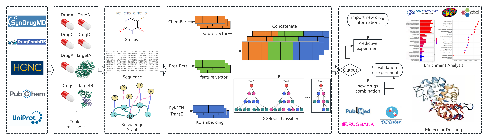

# KGP-DC: Knowledge Graph-Powered Drug Combination Prediction

[](https://www.python.org/downloads/)
[](https://opensource.org/licenses/MIT)

A framework for predicting synergistic drug combinations by integrating knowledge graphs, pre-trained molecular features, and protein sequence embeddings.

## Overview



## Description

The process consists of five main steps: 1. Collect drug-drug combination information and drug-target interaction information from various databases, such as SynDrugMD, as well as from the literature. 2. Further organize the dataset and remove redundant information based on the collected drug CIDs, drug database names, and target IDs. 3. Based on the collected information, construct a knowledge graph and convert the chemical structure (SMILES) information of drugs and the sequence information of target proteins. 4. Utilize the pre-trained models ChemBert and Prot_Bert to extract feature vectors from drug chemical structure information and corresponding target sequence information, respectively, while employing the TransE model for embedding learning to represent drug-drug combinations. 5. Build an XGBoost model to identify potential drug-drug combinations.

## Project Structure

```
SynDrugMD/
├── Database/                  # DDI and DTI datasets
│   ├── DDI.csv
│   └── DTI.csv
├── Triples/                   # KG triple construction & embedding
│   ├── create triples.py
│   ├── get embeddings.py
│   └── embeddings/
├── Proformance/               # Feature engineering & model training
│   ├── feature.py             # Drug pair feature vector construction
│   ├── model.py               # XGBoost training & evaluation
│   ├── smiles/                # Drug SMILES & ChemBERTa features
│   ├── targets/               # Protein sequences & ProtT5 features
│   ├── embeddings/            # TransE KG embeddings
│   └── model_results/         # Trained model & metrics
├── Similarity/                # Drug & combo similarity analysis
│   ├── morgan.py              # Morgan fingerprint extraction
│   ├── sim.py                 # Cosine similarity computation & visualization
│   ├── DB_id_smiles.csv       # DrugCombDB drug SMILES data
│   ├── Syn_id_smiles.csv      # SynDrugMD drug SMILES data
│   ├── syn_morgan_features/   # Pre-computed SynDrugMD Morgan fingerprints
│   ├── db_morgan_features/    # Pre-computed DrugCombDB Morgan fingerprints
│   └── complete_analysis.png  # Similarity heatmap & distribution plot
├── requirements.txt
├── LICENSE
└── README.md
```

## Dependencies

Developed and tested with **Python 3.8.20**. Install all dependencies:

```bash
pip install -r requirements.txt
```

Key packages:

| Package      | Version   | Purpose                               |
| ------------ | --------- | ------------------------------------- |
| pykeen       | 1.10.2    | Knowledge graph embedding (TransE)    |
| xgboost      | 2.1.4     | Drug combination classifier           |
| scikit-learn | 1.3.2     | Metrics & data splitting              |
| rdkit        | ≥2023.03 | Morgan fingerprint computation        |
| transformers | ≥4.30.0  | ChemBERTa & ProtT5 feature extraction |
| torch        | ≥2.0.0   | Deep learning backend                 |

## Usage

### 1. Build Knowledge Graph Triples & Embeddings

```bash
cd Triples/
python "create triples.py"
python "get embeddings.py"
```

### 2. Generate Feature Vectors & Train Model

```bash
cd ../Proformance/
python feature.py
python model.py
```

### 3. Drug Similarity Analysis

```bash
cd ../Similarity/
# Generate Morgan fingerprints (if not pre-computed)
python morgan.py

# Compute drug & combination similarity matrices
python sim.py
```

## Similarity Analysis


The `Similarity/` module evaluates the redundancy of drug features and drug combination representations across two benchmark datasets (**SynDrugMD** and **DrugCombDB**). The analysis proceeds as follows:

1. **Morgan Fingerprint Extraction** — Convert drug SMILES strings into 1024-bit Morgan fingerprints (ECFP4) using RDKit.
2. **Drug Similarity Matrix** — Compute the pairwise cosine similarity matrix for all individual drugs in each dataset.
3. **Drug Combination Features** — For each known drug pair (extracted from KG triples with `rel_id == 0`), concatenate the Morgan fingerprints of the two constituent drugs to form a 2048-dimensional combination feature vector.
4. **Combination Similarity Matrix** — Compute the pairwise cosine similarity matrix across all drug combination feature vectors using chunked computation for memory efficiency.
5. **Visualization** — Generate a 2×3 panel figure with:
   - **Top row (SynDrugMD)**: Drug-drug similarity heatmap, combination-combination similarity heatmap, and side-by-side similarity distribution histogram.
   - **Bottom row (DrugCombDB)**: Corresponding heatmaps and histogram for the second dataset.

The resulting heatmaps and histograms reveal the similarity distribution patterns of drugs and their combinations, providing insight into feature redundancy and dataset diversity.

## License

This project is licensed under the MIT License — see the [LICENSE](LICENSE) file for details.

## Citation

If you use KGP-DC in your research, please cite our work:

```bibtex
@article{kgpdc2026,
  title={KGP-DC: A Framework for Predicting Drug Combinations by Integrating Knowledge Graphs and Pre-trained Features},
  author={Tao Yuan},
  journal={},
  year={2026}
}
```
